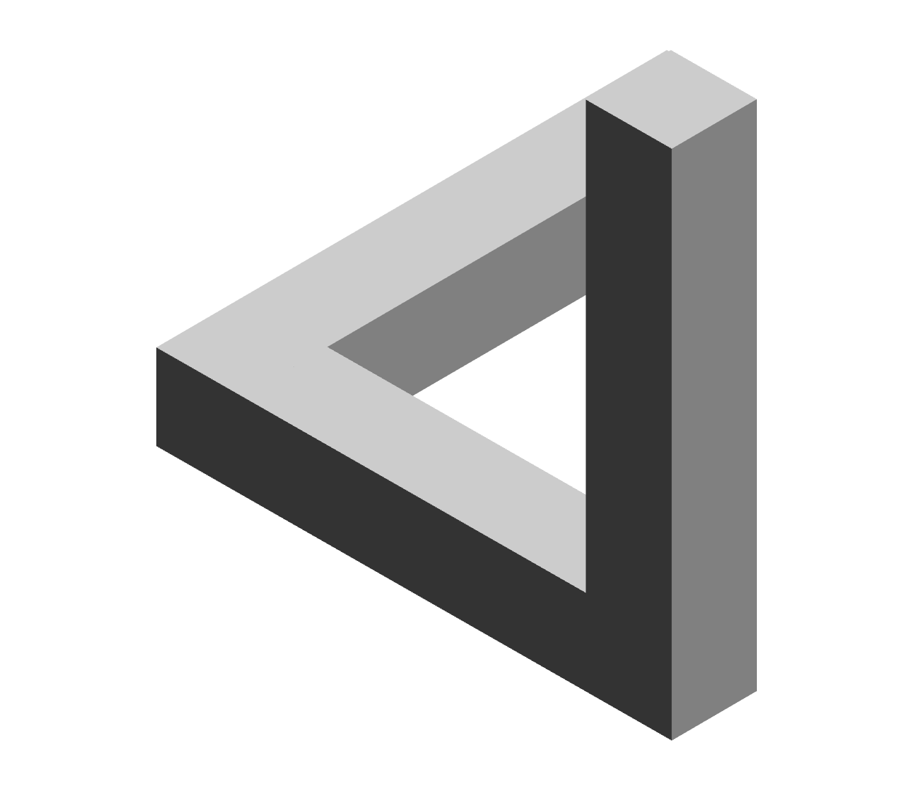
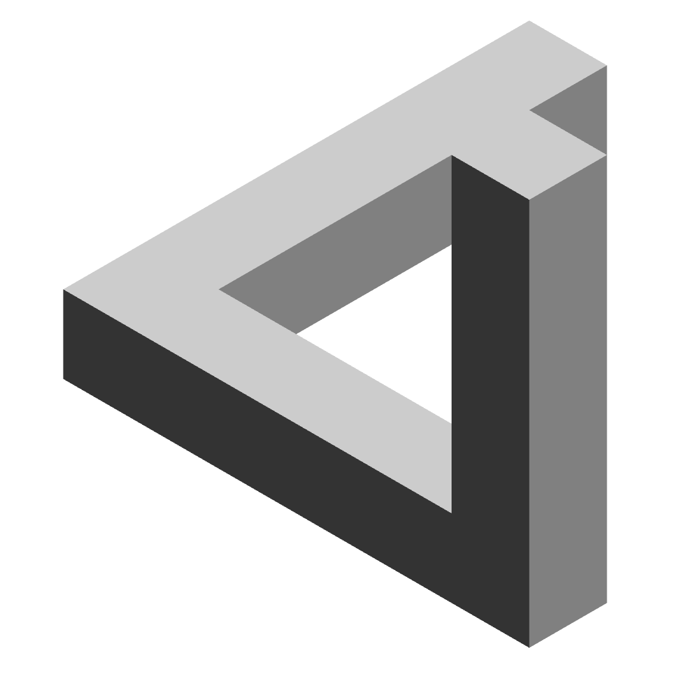
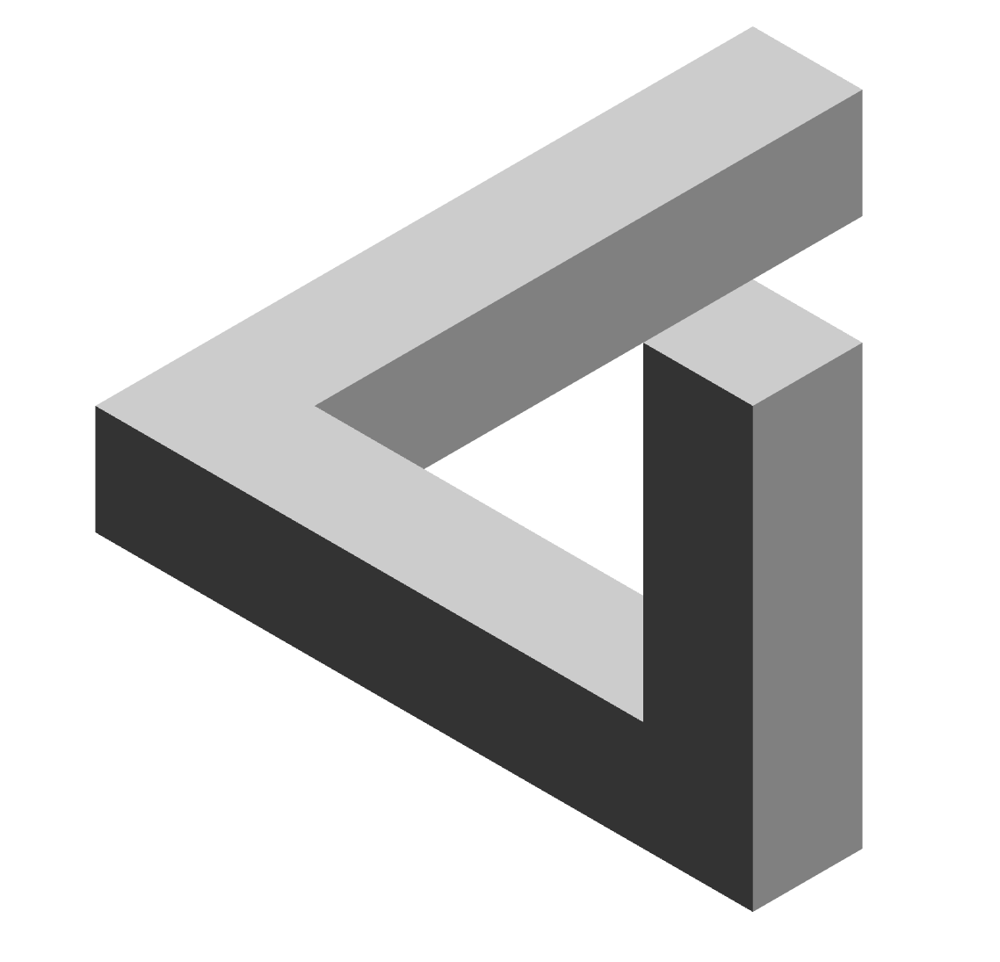
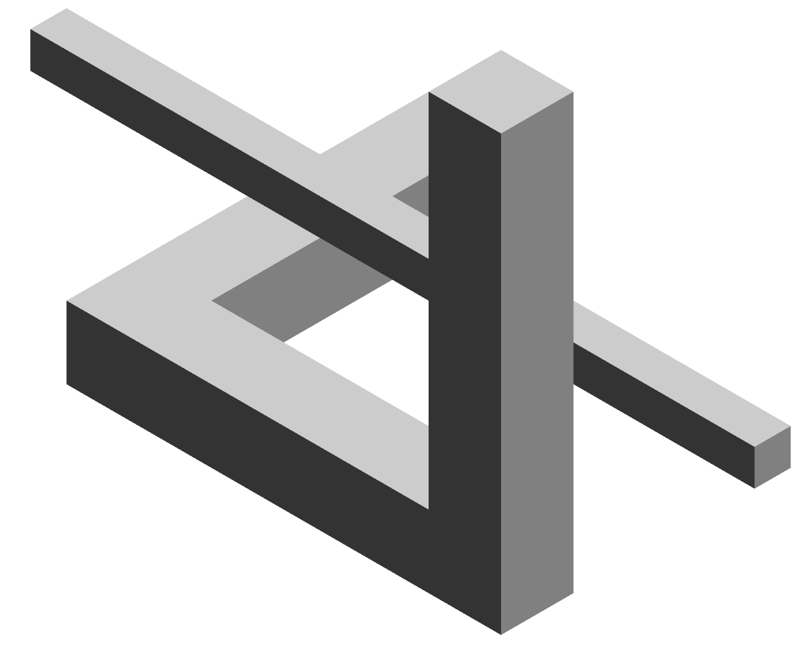
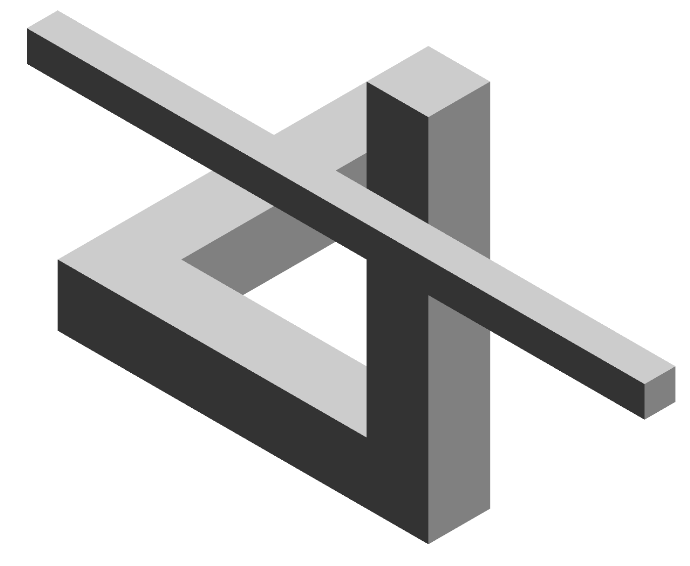
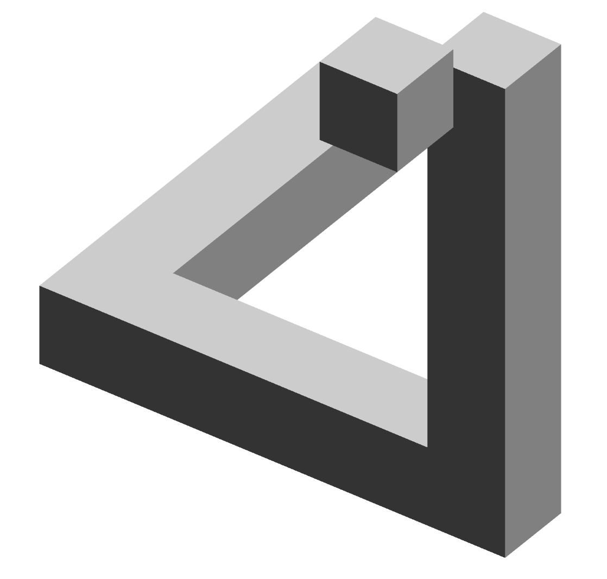
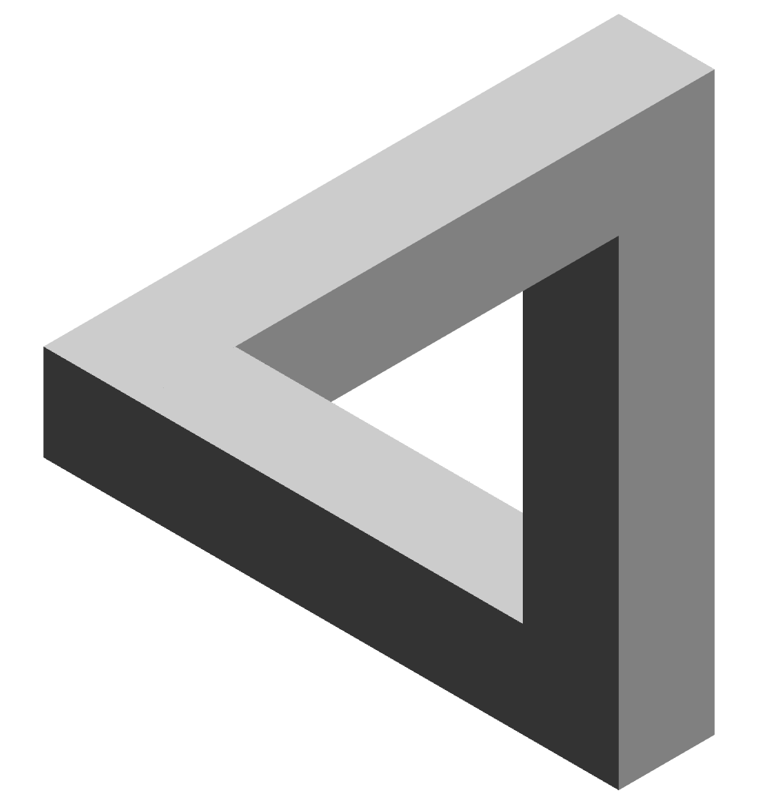
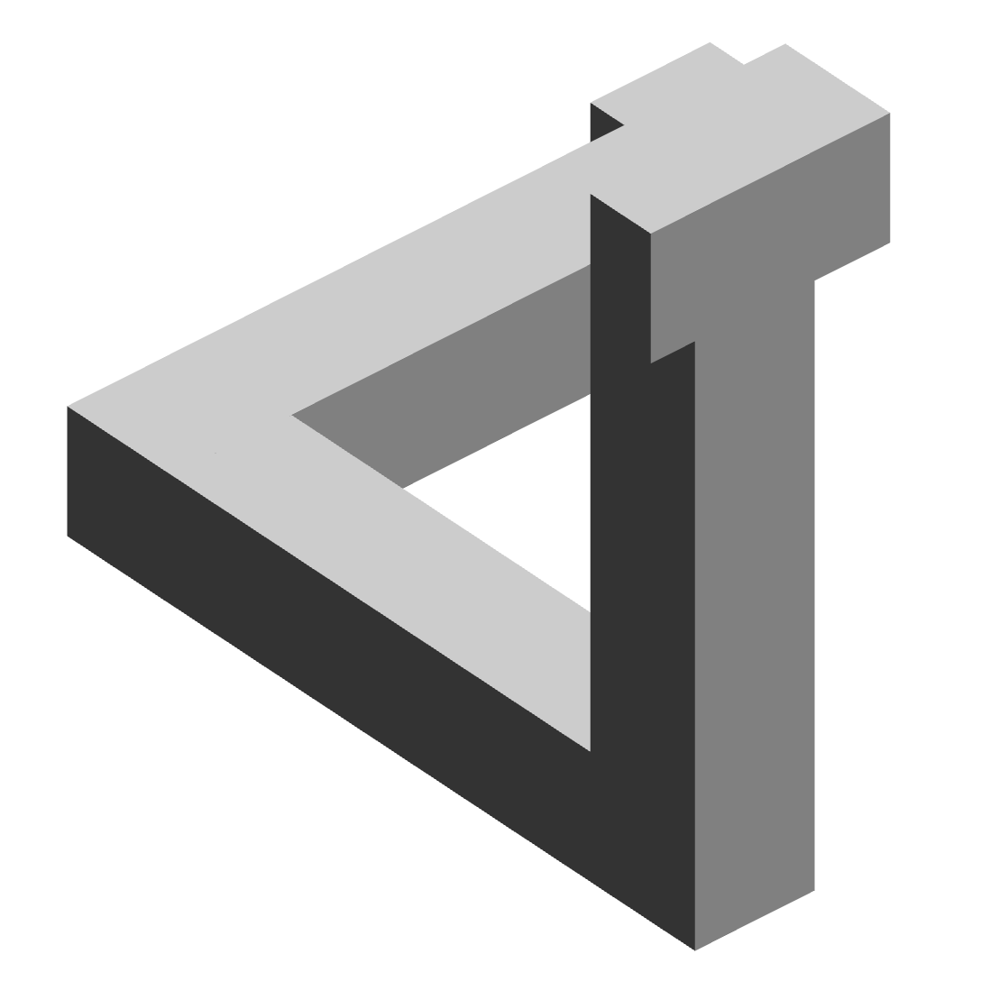

# 今日任务

## 2024-4-7

- [x] 显示一个简单的关卡，不可能三角。
- [x] 添加旋转时改变位置的功能。
- [ ] 可选：显示一个角色，可以控制移动。
- [ ] 可选：创建起点终点，

目前可以显示这种结构，但是几何关系仍然是ok的

这就非常有意思了，无论我们怎么布局，总会产生前面柱子遮挡后面的柱子这种局面，因而无法形成不可能图形。
因此我需要创建一种柱子，它可以显示在前方。我想到了利用 zindex 的方法。我们在创建图形之外，额外加一个符加的 z-index ，用以保证绘制的图形可以位于最上方。如下方的两个示意图所示，前者是没有加 z-index 的图形，后者是加了 z-index 的图形，尽管中间的杆子在柱子后方，但是显示出来的它却在最前面。
但是，请注意，这种方法哟有一个缺陷，就是当图形旋转时，会产生失真/滑动的感觉。

我们将左后方添加一个会显示在前面的矩形，然后就可以看起来正常了。如果是一个永远显示在前方的正方体，也会遮挡住一些不该挡住的东西，很怪。因此，我们只能使用两个正方形挡板放在前方，保证显示正常。

这只是在静态下可以正常，一旦转动一下，就会露馅（如下）

这个看起来是没法通过渲染解决的，这是不可能图形本身存在的完备性错误导致的结果。

因此我们可以通过函数结合角度来控制图形的样式。