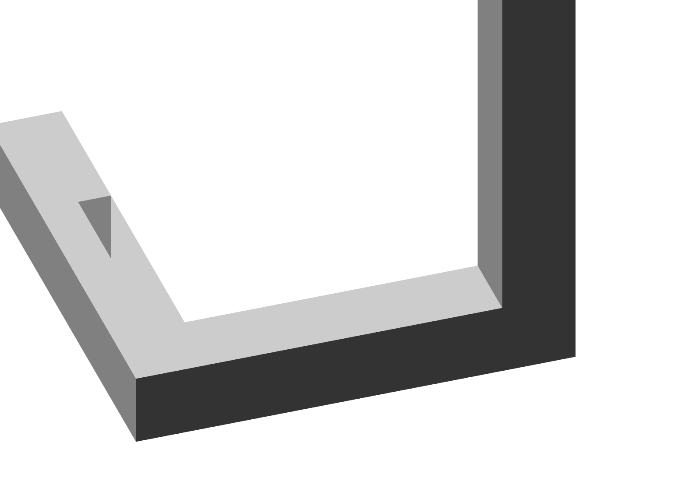
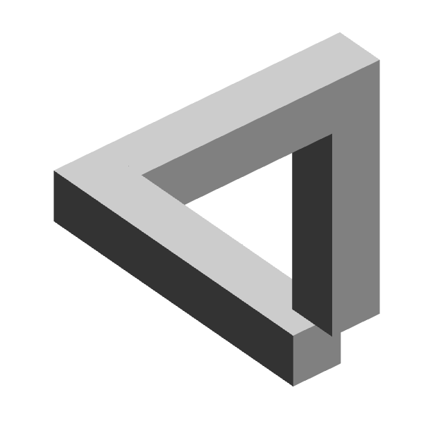
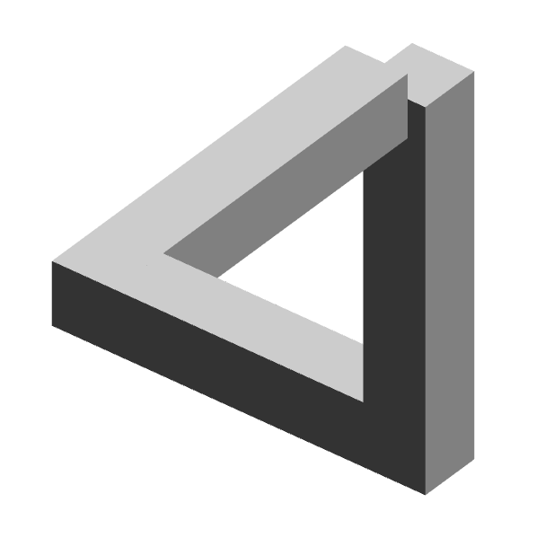

# 今日任务

## 2024-4-7

- [x] 显示一个简单的关卡，不可能三角。
- [x] 添加旋转时改变位置的功能。
- [ ] 可选：显示一个角色，可以控制移动。
- [ ] 可选：创建起点终点，

目前可以显示这种结构，但是几何关系仍然是ok的

这就非常有意思了，无论我们怎么布局，总会产生前面柱子遮挡后面的柱子这种局面，因而无法形成不可能图形。
因此我需要创建一种柱子，它可以显示在前方。我想到了利用 zindex 的方法。我们在创建图形之外，额外加一个符加的 z-index ，用以保证绘制的图形可以位于最上方。如下方的两个示意图所示，前者是没有加 z-index 的图形，后者是加了 z-index 的图形，尽管中间的杆子在柱子后方，但是显示出来的它却在最前面。
但是，请注意，这种方法哟有一个缺陷，就是当图形旋转时，会产生失真/滑动的感觉。

我们将左后方添加一个会显示在前面的矩形，然后就可以看起来正常了。如果是一个永远显示在前方的正方体，也会遮挡住一些不该挡住的东西，很怪。因此，我们只能使用两个正方形挡板放在前方，保证显示正常。

这只是在静态下可以正常，一旦转动一下，就会露馅（如下）

这个看起来是没法通过渲染解决的，这是不可能图形本身存在的完备性错误导致的结果。

因此我们可以通过函数结合角度来控制图形的样式。
当它反向旋转时，我们断开下方的连接，形成如下所示的样子。而正向旋转则断开上方的连接。

## 2024-4-9
- [x] 修复截图工具（目前状态：可以截图，但是需要第二次才能截取到正确的图像，无法录屏）
  - [x] 可选：或者加入内置截图录屏工具
- [ ] 可选：显示一个角色，可以控制移动。
- [ ] 可选：创建起点终点，

目前我看到的方法是使用 Frame::request_screen_shot 在程序内获取屏幕捕捉，其它的修复方案暂未看到。

然后使用 image 库存储到图片，或使用 video-rs 以及 ffmpeg-ffi 保存到 MP4.

现在的问题是图片还好，因为是异步多线程保存到文件，不用担心延迟，但是视频编码速度过慢，需要大量额外时间进行编码。且视频编码时必须使用合适尺寸的窗口，不能任意窗口。

我已经测试了 Windows 截屏，以及 Faststone Capture 截图软件，两者均不能正常截取图片，录屏更是完全录不上。准备再尝试一下 OBS 。最后，好消息是 OBS 可以正常录制，坏消息是我已经基本写好了。

使用程序自带的(我写的)录屏功能录制的视频：
<video controls src="assets/video-1.mp4" title="Recording by Rust"></video>

使用 OBS 录制的视频：
<video controls src="assets/video-2.mkv" title="Recording by Rust"></video>

